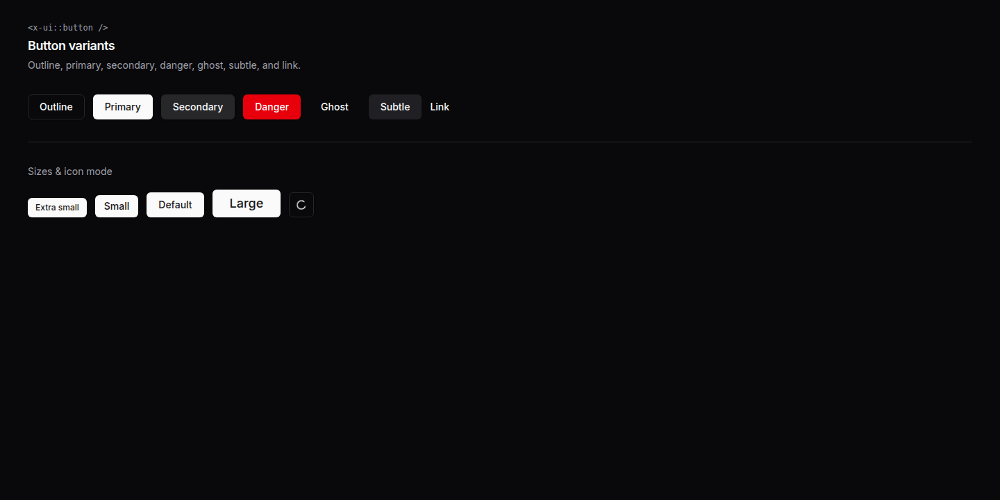
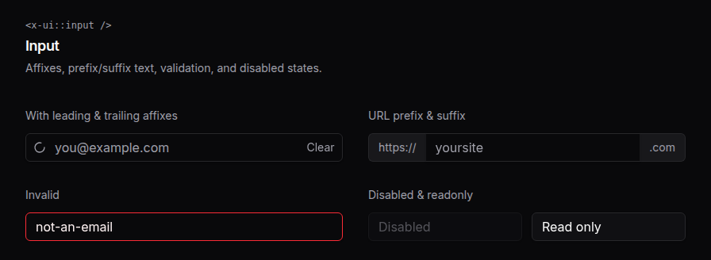
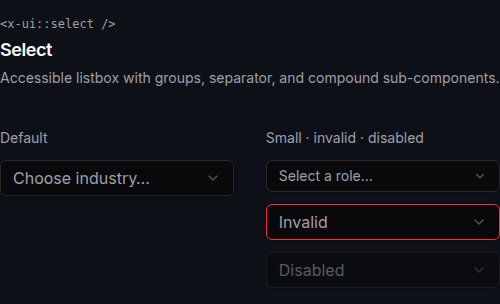
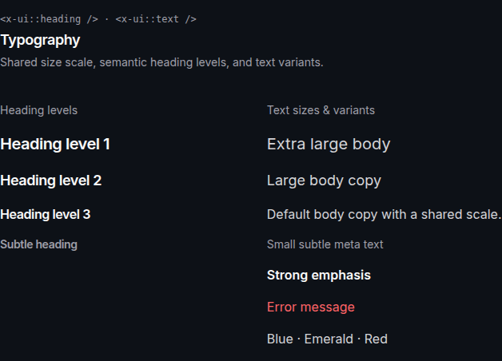
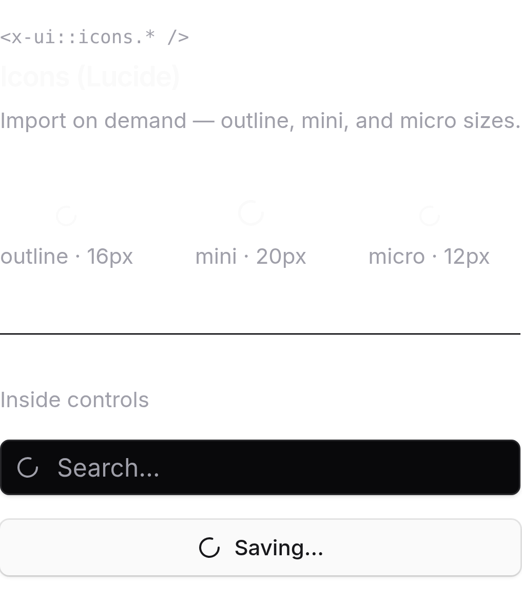

<div align="center">

<a href="#table-of-contents">
  
</a>

# Stencil

**Composable Blade primitives for Laravel — vendor quick start or shadcn-style owned UI.**

<p>
    <a href="https://packagist.org/packages/ivanfuhr/stencil"></a>
    <a href="https://packagist.org/packages/ivanfuhr/stencil"></a>
    <a href="https://packagist.org/packages/ivanfuhr/stencil"></a>
    <a href="https://github.com/ivanfuhr/stencil/actions"></a>
    <a href="https://packagist.org/packages/ivanfuhr/stencil"></a>
</p>

</div>

<br>

<h2 id="table-of-contents">📑 Table of contents</h2>

| 🧩 **Components** | 📖 **Guide** | 🛠 **Project** |
| :--- | :--- | :--- |
| [Button](#button) · [Input](#input) · [Select](#select) · [Typography](#typography) · [Icons](#icons) | [Installation](#installation) · [Usage](#usage) · [Registry CLI](#registry-cli) · [Tailwind](#tailwind-css) · [Playbook](#development) | [Changelog](CHANGELOG.md) · [Contributing](.github/CONTRIBUTING.md) · [Security](.github/SECURITY.md) · [License](LICENSE.md) |

<br>

Copy only what you need with `stencil:add`, use `x-ui::*` in your app, and keep Tailwind v4 + class-based dark mode aligned with the design system. Screenshots are frameless — background matches the theme (click to enlarge).

<br>

## Button

Variants: `outline`, `primary`, `secondary`, `danger`, `ghost`, `subtle`, `link` — sizes `xs`–`lg`, icon mode (`square`), and `leading` / `trailing` slots.

**Light** · click to enlarge

[](docs/images/buttons-light.png)

**Dark**

[](docs/images/buttons-dark.png)

```blade
<x-ui::button variant="primary" size="lg">Save changes</x-ui::button>

<x-ui::button variant="outline" square>
    <x-ui::icons.search />
</x-ui::button>
```

```bash
php artisan stencil:add button
```

<br>

## Input

Affixes, `prefix` / `suffix`, and `invalid`, `disabled`, and `readonly` states.

**Light**

[](docs/images/input-light.png)

**Dark**

[](docs/images/input-dark.png)

```blade
<x-ui::input name="email" type="email" placeholder="you@example.com">
    <x-slot:leading><x-ui::icons.search /></x-slot:leading>
    <x-slot:trailing>
        <x-ui::text inline size="sm" variant="subtle">Clear</x-ui::text>
    </x-slot:trailing>
</x-ui::input>

<x-ui::input name="site" prefix="https://" suffix=".com" placeholder="yoursite" />
```

```bash
php artisan stencil:add input
```

<br>

## Select

Accessible listbox (not a native `<select>`). Subcomponents: `trigger`, `value`, `content`, `group`, `item`. Requires `select.js` in Vite after `add select`.

**Light**

[](docs/images/select-light.png)

**Dark**

[](docs/images/select-dark.png)

```blade
<x-ui::select name="industry" placeholder="Choose industry…">
    <x-ui::select.group>
        <x-ui::select.label>Creative</x-ui::select.label>
        <x-ui::select.item value="photo">Photography</x-ui::select.item>
    </x-ui::select.group>
    <x-ui::select.separator />
    <x-ui::select.item value="web">Web development</x-ui::select.item>
</x-ui::select>
```

```bash
php artisan stencil:add select
```

<br>

## Typography

`<x-ui::heading />` with semantic levels `1`–`6` and `<x-ui::text />` with the `sm` / `default` / `lg` / `xl` scale, variants, and colors.

**Light**

[](docs/images/typography-light.png)

**Dark**

[](docs/images/typography-dark.png)

```blade
<head>
    <x-stencil::fonts />
</head>

<x-ui::heading :level="2">Page title</x-ui::heading>
<x-ui::text variant="subtle" size="sm">Meta line</x-ui::text>
<x-ui::text color="blue">Semantic color</x-ui::text>
```

```bash
php artisan stencil:add text heading
```

<br>

## Icons

On-demand [Lucide](https://lucide.dev/icons/) icons — `outline` (16px), `mini` (20px), and `micro` (12px) variants.

**Light**

[](docs/images/icons-light.png)

**Dark**

[](docs/images/icons-dark.png)

```bash
php artisan stencil:icon search grip-vertical
```

```blade
<x-ui::icons.search />
<x-ui::icons.search variant="mini" class="text-amber-500" />
```

<br>

---

## Installation

```bash
composer require --dev ivanfuhr/stencil
```

The package is a **development dependency** (registry CLI). After `init` and `add`, your app runs from files under `resources/views/ui` and `app/Support/Stencil` — production can use `composer install --no-dev`.

```bash
php artisan vendor:publish --tag="stencil"
```

| Tag | Resource |
| --- | --- |
| `stencil-config` | Configuration |
| `stencil-views` | Package views |
| `stencil-lang` | Translations |
| `stencil-assets` | Public assets |

<br>

## Usage

**Vendor (quick start)**

```blade
<x-stencil::input name="email" />
```

**Owned (shadcn-style)**

```bash
php artisan stencil:init
php artisan stencil:add input button select
```

```blade
<x-ui::input name="email" />
```

### Registry CLI

<h3 id="registry-cli"></h3>

| Command | Description |
| --- | --- |
| `stencil:init` | Create `stencil.json`, support/CSS, and lock file |
| `stencil:add {names}` | Install from the registry |
| `stencil:update {name?}` | Refresh installed files |
| `stencil:remove {names}` | Remove installed components |
| `stencil:list` | List registry items (`--installed`) |
| `stencil:icon {names?}` | Import Lucide icons |

### Tailwind CSS

<h3 id="tailwind-css"></h3>

`init` creates `resources/css/stencil.css` and patches the import in `app.css`. Scans `resources/views` and `app/Support/Stencil`, and registers class-based dark mode (`.dark` on `<html>`).

```css
@import "tailwindcss";

/* stencil-start */
@import "./stencil.css";
/* stencil-end */
```

With `APP_DEBUG=true`, missing integration throws a clear exception (disable via `stencil.validate_tailwind_integration`). Default registry: `package://registry.json`. Rebuild: `composer registry:build`.

<br>

## Development

<h3 id="development"></h3>

```bash
composer playbook              # /playbook — interactive playground
composer workbench:build
composer serve
```

Refresh README screenshots (server at `http://127.0.0.1:8001`):

```bash
./scripts/capture-readme-images.sh
# Pages: /playbook/media/{buttons|input|select|typography|icons}?dark=1
```

## Changelog

[CHANGELOG](CHANGELOG.md)

## Contributing

[Contributing guide](.github/CONTRIBUTING.md)

## Security

[Security policy](.github/SECURITY.md)

## Credits

- [Ivan Führ](https://github.com/ivanfuhr)
- [All Contributors](../../contributors)

## License

[MIT](LICENSE.md)
