<div align="center">

<a href="#table-of-contents">
  
</a>

**Composable Blade primitives for Laravel — registry CLI and owned `x-ui::*` components.**

<p>
    <a href="https://packagist.org/packages/ivanfuhr/stencil"></a>
    <a href="https://packagist.org/packages/ivanfuhr/stencil"></a>
    <a href="https://packagist.org/packages/ivanfuhr/stencil"></a>
    <a href="https://github.com/ivanfuhr/stencil/actions"></a>
    <a href="https://packagist.org/packages/ivanfuhr/stencil"></a>
</p>

</div>

<br>

<h2 id="table-of-contents">📑 Table of contents</h2>

| 🧩 **Components** | 📖 **Guide** | 🛠 **Project** |
| :--- | :--- | :--- |
| [Button](#button) · [Input](#input) · [Label](#label) · [Field](#field) · [Textarea](#textarea) · [Checkbox](#checkbox) · [Radio](#radio) · [Switch](#switch) · [Select](#select) · [Typography](#typography) · [Icons](#icons) | [Installation](#installation) · [Usage](#usage) · [Registry CLI](#registry-cli) · [Tailwind](#tailwind-css) · [Playbook](#development) | [Changelog](CHANGELOG.md) · [Contributing](.github/CONTRIBUTING.md) · [Security](.github/SECURITY.md) · [License](LICENSE.md) |

<br>

Copy only what you need with `stencil:add`, use `x-ui::*` in your app, and keep Tailwind v4 + class-based dark mode aligned with the design system.

Follow [Installation](#installation) and [Usage](#usage), then use the component previews further down once items are installed.

---

## Installation

```bash
composer require --dev ivanfuhr/stencil
```

The package is a **development dependency** (registry CLI). Run `stencil:init` and `stencil:add` to copy components into your app under `resources/views/ui` and `app/Support/Stencil`. Commit those files so production can run `composer install --no-dev` without the package.

Optional config publish:

```bash
php artisan vendor:publish --tag=stencil-config
```

<br>

## Usage

Initialize the project, browse the registry, then install only what you need. `stencil:add` resolves **`registryDependencies`** automatically (for example, `input` also installs `input-group`, `field`, and `text`).

```bash
php artisan stencil:init
php artisan stencil:list
php artisan stencil:add input button select
```

`stencil:init` scaffolds `stencil.json`, `stencil.lock`, Tailwind integration (`resources/css/stencil.css` + import in `app.css`), support classes, `<x-ui::fonts />`, and registers `App\Providers\StencilUiServiceProvider` in `bootstrap/providers.php` when that file exists.

Use the owned Blade namespace in your app:

```blade
<x-ui::input name="email" />
```

**Registry UI items:** `button`, `checkbox`, `field`, `heading`, `icon`, `input`, `input-group`, `label`, `radio`, `select`, `switch`, `text`, `textarea`. Lower-level pieces such as `field`, `input-group`, and `label` are usually installed transitively. **Lucide icons:** run `stencil:add icon` once, then `stencil:icon {name}` per icon (see [Icons](#icons)).

### Registry CLI

<h3 id="registry-cli"></h3>

| Command | Description |
| --- | --- |
| `stencil:init` | Create `stencil.json`, scaffold owned support/CSS, and `stencil.lock` |
| `stencil:add {names}` | Install from the registry (includes dependencies) |
| `stencil:update {name?}` | Refresh installed files |
| `stencil:remove {names}` | Remove installed components |
| `stencil:list` | List registry items (`--installed`, `--all`) |
| `stencil:icon {names}` | Import Lucide icon stubs into `resources/views/ui/icons` |

### Tailwind CSS

<h3 id="tailwind-css"></h3>

Owned UI is scanned from `resources/views` and `app/Support/Stencil` via `resources/css/stencil.css`, with class-based dark mode (`.dark` on `<html>`).

```css
@import "tailwindcss";

/* stencil-start */
@import "./stencil.css";
/* stencil-end */
```

With `APP_DEBUG=true` and the package still installed, missing integration throws a clear exception (disable via `stencil.validate_tailwind_integration` in config). Default registry URL: `package://registry.json` (overridable in `stencil.json`).

<br>

---

Component previews match your GitHub theme via `<picture>` (`prefers-color-scheme`).

<br>

## Button

Variants: `outline`, `primary`, `secondary`, `danger`, `ghost`, `subtle`, `link` — sizes `xs`–`lg`, icon mode (`square`), and `leading` / `trailing` slots.

<picture>
  <source media="(prefers-color-scheme: dark)" srcset="docs/images/buttons-dark.png">
  <source media="(prefers-color-scheme: light)" srcset="docs/images/buttons-light.png">
  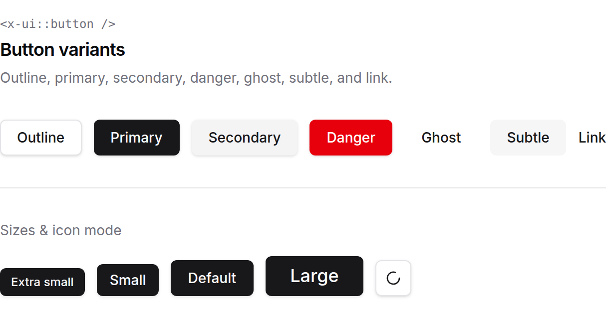
</picture>

```blade
<x-ui::button variant="outline">Outline</x-ui::button>
<x-ui::button variant="primary">Primary</x-ui::button>
<x-ui::button variant="secondary">Secondary</x-ui::button>
<x-ui::button variant="danger">Danger</x-ui::button>
<x-ui::button variant="ghost">Ghost</x-ui::button>
<x-ui::button variant="subtle">Subtle</x-ui::button>
<x-ui::button variant="link">Link</x-ui::button>

<x-ui::button variant="primary" size="xs">Extra small</x-ui::button>
<x-ui::button variant="primary" size="sm">Small</x-ui::button>
<x-ui::button variant="primary">Default</x-ui::button>
<x-ui::button variant="primary" size="lg">Large</x-ui::button>
<x-ui::button variant="outline" square>
    <x-ui::icon.loading />
</x-ui::button>
```

```bash
php artisan stencil:add button icon
```

The square button uses the built-in loading icon from `stencil:add icon`.

<br>

## Input

Affixes, `prefix` / `suffix`, and `invalid`, `disabled`, and `readonly` states.

<picture>
  <source media="(prefers-color-scheme: dark)" srcset="docs/images/input-dark.png">
  <source media="(prefers-color-scheme: light)" srcset="docs/images/input-light.png">
  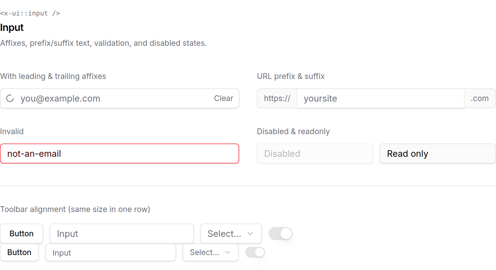
</picture>

```blade
<x-ui::input name="email" type="email" placeholder="you@example.com">
    <x-slot:leading>
        <x-ui::icon.loading />
    </x-slot:leading>
    <x-slot:trailing>
        <x-ui::text inline size="sm" variant="subtle">Clear</x-ui::text>
    </x-slot:trailing>
</x-ui::input>

<x-ui::input name="site" placeholder="yoursite" prefix="https://" suffix=".com" />

<x-ui::input name="email" value="not-an-email" invalid />

<x-ui::input name="a" placeholder="Disabled" disabled />
<x-ui::input name="b" value="Read only" readonly />

<x-ui::button variant="outline">Button</x-ui::button>
<x-ui::input name="align-default" placeholder="Input" class="w-36" />
<x-ui::select name="align-select-default" placeholder="Select…" class="w-40">
    <x-ui::select.item value="a">Option A</x-ui::select.item>
</x-ui::select>
<x-ui::switch name="align-switch-default" :checked="true" />

<x-ui::button variant="outline" size="sm">Button</x-ui::button>
<x-ui::input name="align-sm" size="sm" placeholder="Input" class="w-36" />
<x-ui::select name="align-select-sm" size="sm" placeholder="Select…" class="w-40">
    <x-ui::select.item value="a">Option A</x-ui::select.item>
</x-ui::select>
<x-ui::switch name="align-switch-sm" size="sm" :checked="true" />
```

```bash
php artisan stencil:add input icon select switch
```

<br>

## Label

Accessible `<label>` with optional `badge` and `required` marker. Pairs with any control via `for` (see [shadcn Label](https://ui.shadcn.com/docs/components/aria/label) and [Flux label](https://fluxui.dev/components/field)).

<picture>
  <source media="(prefers-color-scheme: dark)" srcset="docs/images/label-dark.png">
  <source media="(prefers-color-scheme: light)" srcset="docs/images/label-light.png">
  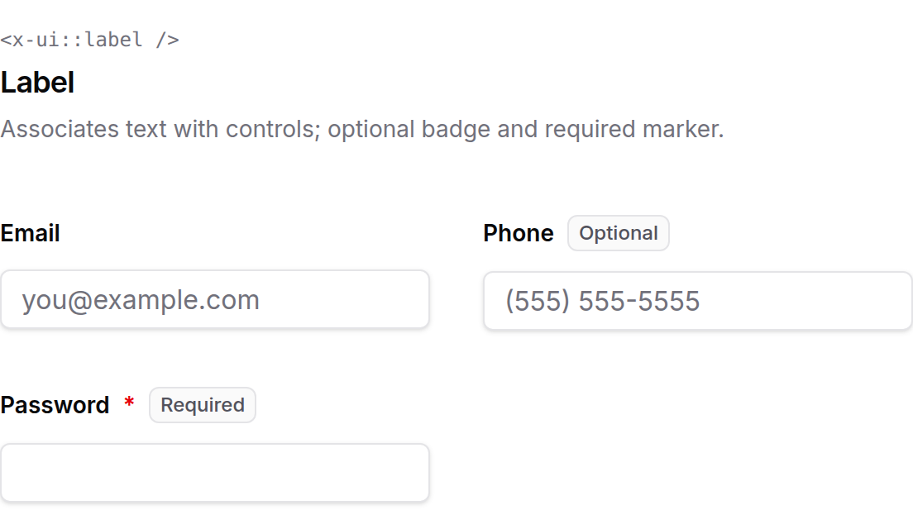
</picture>

```blade
<x-ui::label for="email">Email</x-ui::label>
<x-ui::input name="email" id="email" type="email" placeholder="you@example.com" />

<x-ui::label for="phone" badge="Optional">Phone</x-ui::label>
<x-ui::input name="phone" id="phone" placeholder="(555) 555-5555" />

<x-ui::label for="password" badge="Required" :required="true">Password</x-ui::label>
<x-ui::input name="password" id="password" type="password" />
```

```bash
php artisan stencil:add label
```

<br>

## Field

Composable field shell: label, control, description, and Laravel errors — inspired by [shadcn Field](https://ui.shadcn.com/docs/components/radix/field) and [Flux field](https://fluxui.dev/components/field). Use `orientation="inline"` for checkbox/switch rows.

<picture>
  <source media="(prefers-color-scheme: dark)" srcset="docs/images/field-dark.png">
  <source media="(prefers-color-scheme: light)" srcset="docs/images/field-light.png">
  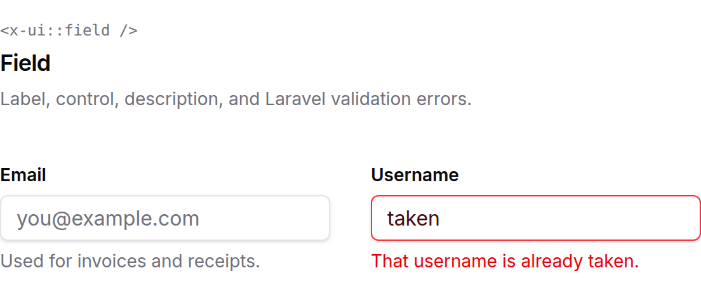
</picture>

```blade
<x-ui::field name="email">
    <x-ui::field.label>Email</x-ui::field.label>
    <x-ui::input name="email" type="email" placeholder="you@example.com" />
    <x-ui::field.description>Used for invoices and receipts.</x-ui::field.description>
</x-ui::field>

<x-ui::field name="username" :invalid="true">
    <x-ui::field.label>Username</x-ui::field.label>
    <x-ui::input name="username" value="taken" />
    <x-ui::field.message variant="error">That username is already taken.</x-ui::field.message>
</x-ui::field>
```

```bash
php artisan stencil:add field
```

<br>

## Textarea

Multi-line control with the same invalid/disabled behavior as `input` ([shadcn Textarea](https://ui.shadcn.com/docs/components/base/textarea)).

<picture>
  <source media="(prefers-color-scheme: dark)" srcset="docs/images/textarea-dark.png">
  <source media="(prefers-color-scheme: light)" srcset="docs/images/textarea-light.png">
  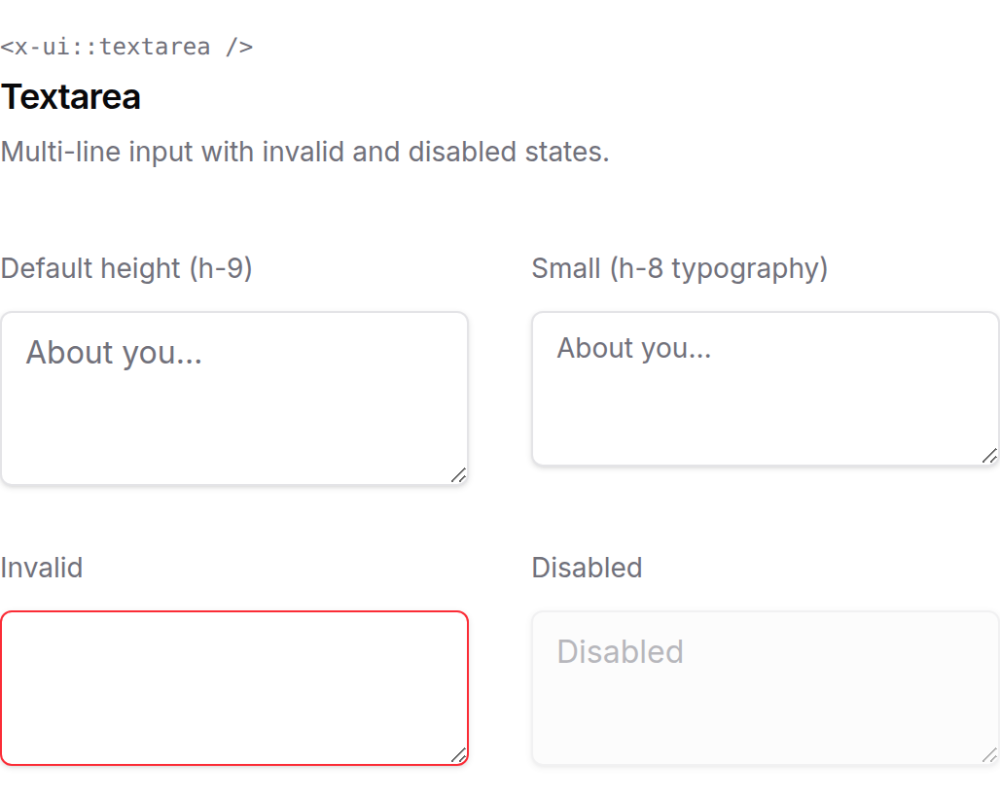
</picture>

```blade
<x-ui::textarea name="bio" placeholder="About you…" rows="3" />
<x-ui::textarea name="bio-sm" size="sm" placeholder="About you…" rows="3" />
<x-ui::textarea name="bio-invalid" :invalid="true" value="Too short" />
<x-ui::textarea name="bio-disabled" disabled placeholder="Disabled" />
```

```bash
php artisan stencil:add textarea
```

<br>

## Checkbox

Native checkbox for forms and multi-select ([Flux checkbox](https://fluxui.dev/docs)).

<picture>
  <source media="(prefers-color-scheme: dark)" srcset="docs/images/checkbox-dark.png">
  <source media="(prefers-color-scheme: light)" srcset="docs/images/checkbox-light.png">
  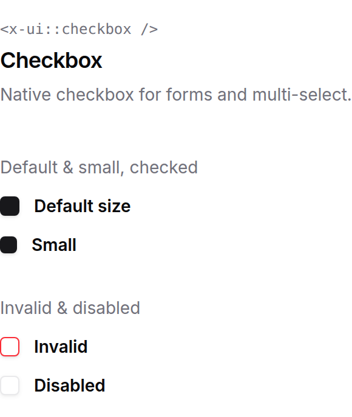
</picture>

```blade
<x-ui::field name="a" orientation="inline">
    <x-ui::checkbox name="a" :checked="true" />
    <x-ui::field.label>Default size</x-ui::field.label>
</x-ui::field>
<x-ui::field name="b" orientation="inline">
    <x-ui::checkbox name="b" size="sm" :checked="true" />
    <x-ui::field.label>Small</x-ui::field.label>
</x-ui::field>
<x-ui::field orientation="inline">
    <x-ui::checkbox name="c" :invalid="true" />
    <x-ui::field.label>Invalid</x-ui::field.label>
</x-ui::field>
<x-ui::field orientation="inline">
    <x-ui::checkbox name="d" disabled />
    <x-ui::field.label>Disabled</x-ui::field.label>
</x-ui::field>
```

```bash
php artisan stencil:add checkbox
```

<br>

## Radio

`radio.group` + `radio` items for single-choice fields ([shadcn Radio Group](https://ui.shadcn.com/docs)).

<picture>
  <source media="(prefers-color-scheme: dark)" srcset="docs/images/radio-dark.png">
  <source media="(prefers-color-scheme: light)" srcset="docs/images/radio-light.png">
  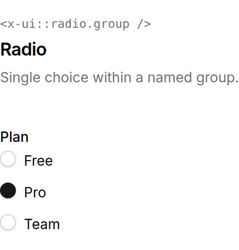
</picture>

```blade
<x-ui::radio.group name="plan" legend="Plan">
    <x-ui::radio value="free">Free</x-ui::radio>
    <x-ui::radio value="pro" :checked="true">Pro</x-ui::radio>
    <x-ui::radio value="team">Team</x-ui::radio>
</x-ui::radio.group>
```

```bash
php artisan stencil:add radio
```

<br>

## Switch

`role="switch"` toggle for settings-style UI ([Flux switch](https://fluxui.dev/components/switch)). Prefer `checkbox` inside classic form posts.

<picture>
  <source media="(prefers-color-scheme: dark)" srcset="docs/images/switch-dark.png">
  <source media="(prefers-color-scheme: light)" srcset="docs/images/switch-light.png">
  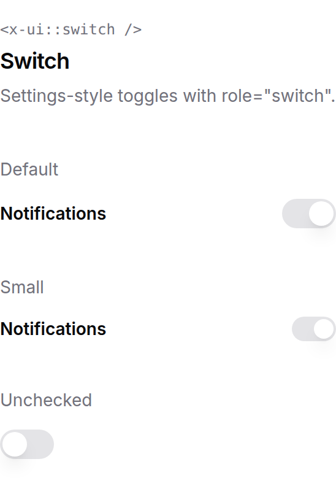
</picture>

```blade
<x-ui::field name="n1" orientation="inline">
    <div class="flex min-w-0 flex-1 flex-col gap-1">
        <x-ui::field.label>Notifications</x-ui::field.label>
    </div>
    <x-ui::switch name="n1" :checked="true" />
</x-ui::field>

<x-ui::field name="n2" orientation="inline">
    <div class="flex min-w-0 flex-1 flex-col gap-1">
        <x-ui::field.label>Notifications</x-ui::field.label>
    </div>
    <x-ui::switch name="n2" size="sm" :checked="true" />
</x-ui::field>

<x-ui::switch name="n3" />
```

```bash
php artisan stencil:add switch
```

<br>

## Select

Accessible listbox (not a native `<select>`). Subcomponents include `trigger`, `value`, `content`, `group`, `label`, `item`, and `separator`. `stencil:add select` copies `select.js` and patches your Vite entry (for example `resources/js/app.js`) to import it.

<picture>
  <source media="(prefers-color-scheme: dark)" srcset="docs/images/select-dark.png">
  <source media="(prefers-color-scheme: light)" srcset="docs/images/select-light.png">
  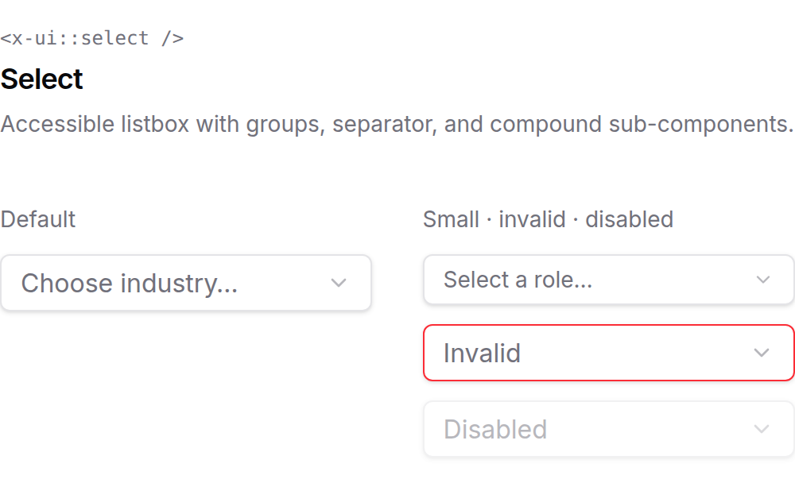
</picture>

```blade
<x-ui::select name="industry" placeholder="Choose industry…">
    <x-ui::select.group>
        <x-ui::select.label>Creative</x-ui::select.label>
        <x-ui::select.item value="photo">Photography</x-ui::select.item>
        <x-ui::select.item value="design">Design services</x-ui::select.item>
    </x-ui::select.group>
    <x-ui::select.separator />
    <x-ui::select.item value="web">Web development</x-ui::select.item>
    <x-ui::select.item value="other">Other</x-ui::select.item>
</x-ui::select>

<x-ui::select name="role" size="sm" placeholder="Select a role…">
    <x-ui::select.item value="admin">Admin</x-ui::select.item>
    <x-ui::select.item value="editor">Editor</x-ui::select.item>
</x-ui::select>
<x-ui::select name="bad" placeholder="Invalid" invalid>
    <x-ui::select.item value="x">Option</x-ui::select.item>
</x-ui::select>
<x-ui::select name="off" placeholder="Disabled" disabled>
    <x-ui::select.item value="x">Option</x-ui::select.item>
</x-ui::select>
```

```bash
php artisan stencil:add select
```

<br>

## Typography

`<x-ui::heading />` with semantic levels `1`–`6` and `<x-ui::text />` with the `sm` / `default` / `lg` / `xl` scale, variants, and colors.

<picture>
  <source media="(prefers-color-scheme: dark)" srcset="docs/images/typography-dark.png">
  <source media="(prefers-color-scheme: light)" srcset="docs/images/typography-light.png">
  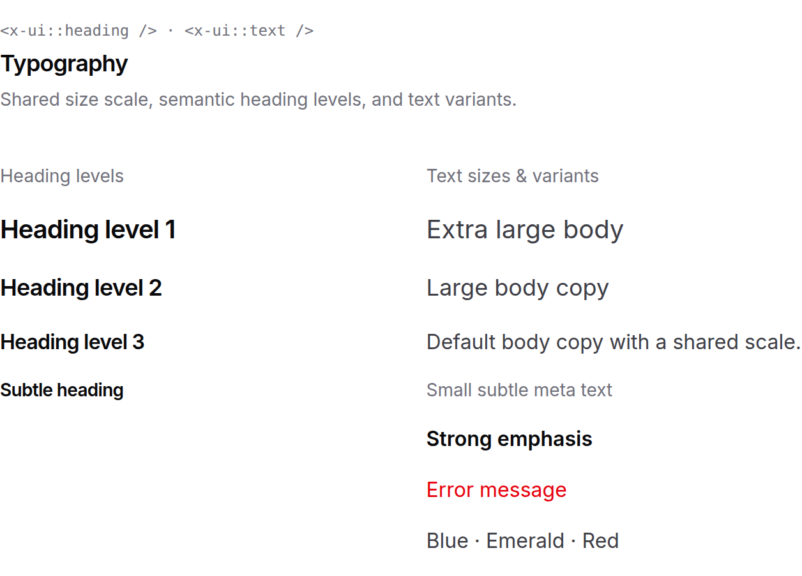
</picture>

```blade
<x-ui::heading :level="1">Heading level 1</x-ui::heading>
<x-ui::heading :level="2">Heading level 2</x-ui::heading>
<x-ui::heading :level="3">Heading level 3</x-ui::heading>
<x-ui::heading :level="4" variant="subtle">Subtle heading</x-ui::heading>

<x-ui::text size="xl">Extra large body</x-ui::text>
<x-ui::text size="lg">Large body copy</x-ui::text>
<x-ui::text>Default body copy with a shared scale.</x-ui::text>
<x-ui::text size="sm" variant="subtle">Small subtle meta text</x-ui::text>
<x-ui::text variant="strong">Strong emphasis</x-ui::text>
<x-ui::text variant="error">Error message</x-ui::text>
<x-ui::text inline color="blue">Blue</x-ui::text>
<x-ui::text inline color="emerald"> · Emerald</x-ui::text>
<x-ui::text inline color="red"> · Red</x-ui::text>
```

```bash
php artisan stencil:add text heading
```

<br>

## Icons

On-demand [Lucide](https://lucide.dev/icons/) icons — `outline` (16px), `mini` (20px), and `micro` (12px) variants. The built-in loading spinner ships with `stencil:add icon`.

```bash
php artisan stencil:add icon
php artisan stencil:icon search
```

<picture>
  <source media="(prefers-color-scheme: dark)" srcset="docs/images/icons-dark.png">
  <source media="(prefers-color-scheme: light)" srcset="docs/images/icons-light.png">
  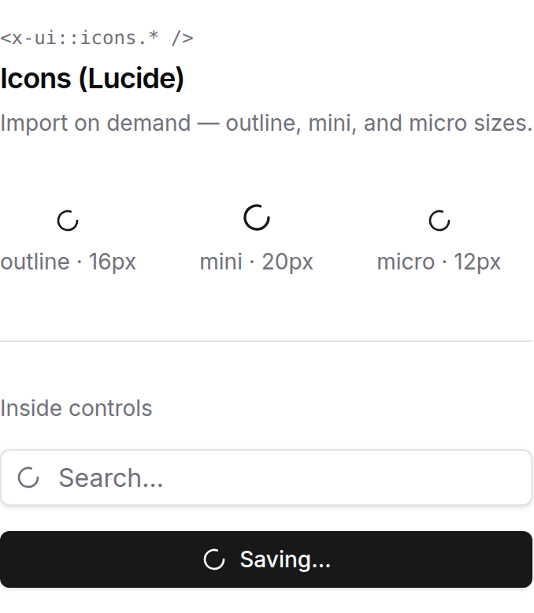
</picture>

```blade
<x-ui::icon.loading class="size-4" />
<x-ui::icon.loading class="size-5" />
<x-ui::icon.loading class="size-3" />

<x-ui::input name="search" placeholder="Search…">
    <x-slot:leading>
        <x-ui::icon.loading />
    </x-slot:leading>
</x-ui::input>

<x-ui::button variant="primary">
    <x-slot:leading>
        <x-ui::icon.loading class="animate-spin" />
    </x-slot:leading>
    Saving…
</x-ui::button>
```

<br>

## Development

<h3 id="development"></h3>

```bash
composer playbook              # /playbook — interactive playground
composer workbench:build
composer serve
```

Package registry rebuild (contributors):

```bash
composer registry:build
```

To refresh README screenshots, run the workbench on port `8001`, then:

```bash
composer build
php vendor/bin/testbench serve --port=8001   # separate terminal
./scripts/capture-readme-images.sh
```

The script crops to `#readme-media` at 2× device pixel ratio by default (`STENCIL_SCREENSHOT_SCALE`, installs `playwright-core` under `scripts/` on first run). Targets: `/playbook/media/{buttons|input|label|field|textarea|checkbox|radio|switch|select|typography|icons}` and the same paths with `?dark=1`.

<br>

## Changelog

[CHANGELOG](CHANGELOG.md)

## Contributing

[Contributing guide](.github/CONTRIBUTING.md)

## Security

[Security policy](.github/SECURITY.md)

## Credits

- [Ivan Führ](https://github.com/ivanfuhr)
- [All Contributors](../../contributors)

## License

[MIT](LICENSE.md)
