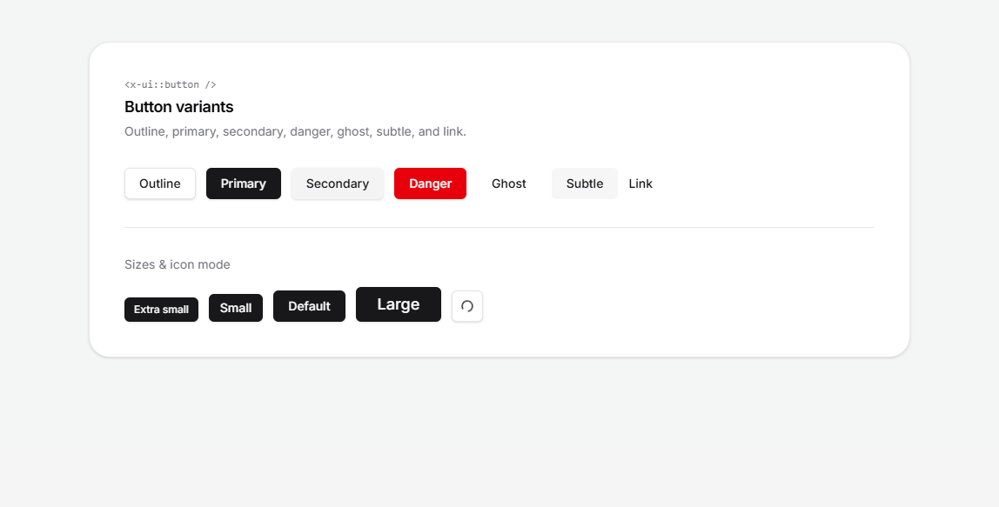
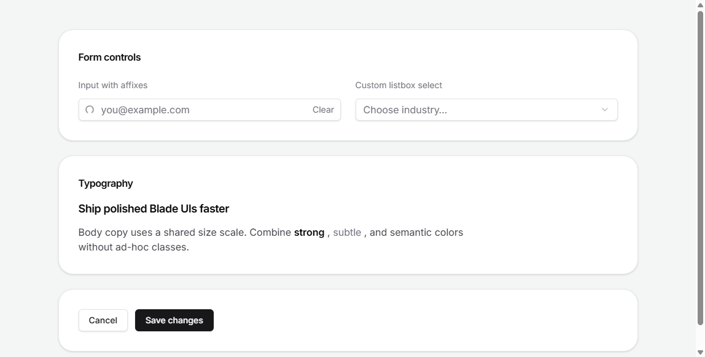

<div align="center">


# BladeX Components

**Composable Blade primitives for Laravel — vendor quick start or shadcn-style owned UI.**

<p>
    <a href="https://packagist.org/packages/ivanfuhr/bladex-components"></a>
    <a href="https://packagist.org/packages/ivanfuhr/bladex-components"></a>
    <a href="https://packagist.org/packages/ivanfuhr/bladex-components"></a>
    <a href="https://github.com/ivanfuhr/bladex-components/actions"></a>
    <a href="https://packagist.org/packages/ivanfuhr/bladex-components"></a>
</p>

[Installation](#installation) · [Usage](#usage) · [Components](#components) · [Development](#development) · [Changelog](CHANGELOG.md)

</div>

---

## Why BladeX?

| | |
| --- | --- |
| **Two adoption paths** | Use `x-bladex-components::*` from vendor for prototypes, or copy primitives into `resources/views/ui` for full ownership. |
| **Registry CLI** | `init`, `add`, `update`, and `remove` — same mental model as shadcn/ui, tuned for Blade. |
| **Tailwind v4 ready** | Class maps live in your app; `bladex.css` wires scanning and class-based dark mode. |
| **Accessible by default** | Focus rings, interaction states, and compound components (select listbox, input affixes). |

## Components

Real output from the package workbench (light and dark). Run `composer playbook` locally to explore every prop interactively.

### Button variants & sizes

Seven visual variants (`outline`, `primary`, `secondary`, `danger`, `ghost`, `subtle`, `link`), four sizes, square icon mode, and leading/trailing slots.

<picture>
  <source media="(prefers-color-scheme: dark)" srcset="docs/images/button-variants-dark.png">
  
</picture>

```blade
<x-ui::button variant="primary" size="lg">Save changes</x-ui::button>
<x-ui::button variant="outline" square>
    <x-ui::icons.search />
</x-ui::button>
```

### Forms & typography

Input affixes, custom listbox select, heading scale, and text variants — without sprinkling one-off Tailwind in every view.

<picture>
  <source media="(prefers-color-scheme: dark)" srcset="docs/images/components-overview-dark.png">
  
</picture>

```blade
<x-ui::input name="email" placeholder="you@example.com">
    <x-slot:leading><x-ui::icons.search /></x-slot:leading>
</x-ui::input>

<x-ui::select name="industry" placeholder="Choose industry…">
    <x-ui::select.item value="design">Design services</x-ui::select.item>
</x-ui::select>

<x-ui::heading>Page title</x-ui::heading>
<x-ui::text variant="subtle" size="sm">Supporting copy</x-ui::text>
```

## Installation

Install via Composer (development dependency — the registry CLI; owned files ship in your app):

```bash
composer require --dev ivanfuhr/bladex-components
```

After `init` and `add`, production deploys can use `composer install --no-dev` without this package.

Publish everything at once:

```bash
php artisan vendor:publish --tag="bladex-components"
```

Or publish individually:

| Tag | Resource |
| --- | --- |
| `bladex-components-config` | Configuration |
| `bladex-components-views` | Package views |
| `bladex-components-lang` | Translations |
| `bladex-components-assets` | Public assets |

## Usage

### Vendor mode (quick start)

```blade
<x-bladex-components::input name="email" />
```

### Owned mode (shadcn-style)

```bash
php artisan bladex-components:init
php artisan bladex-components:add input button select
```

```blade
<x-ui::input name="email" />
```

| Command | Description |
| --- | --- |
| `bladex-components:init` | Create `bladex-components.json`, scaffold support/CSS, empty lock file |
| `bladex-components:add {names}` | Install components from the registry |
| `bladex-components:update {name?}` | Refresh installed files |
| `bladex-components:remove {names}` | Remove installed components |
| `bladex-components:list` | List registry items (`--installed` for installed only) |
| `bladex-components:icon {names?}` | Import Lucide icons into `resources/views/ui/icons` |

### Icons (Lucide)

On-demand imports from [Lucide](https://lucide.dev/icons/):

```bash
php artisan bladex-components:icon search grip-vertical
```

```blade
<x-ui::icons.search />
<x-ui::icons.search variant="mini" class="text-amber-500" />
```

Supported variants: `outline` (16px), `mini` (20px), `micro` (12px).

### Tailwind CSS

`bladex-components:init` creates `resources/css/bladex.css` and patches `resources/css/app.css`:

```css
@import "tailwindcss";

/* bladex-components-start */
@import "./bladex.css";
/* bladex-components-end */
```

`bladex.css` scans `resources/views` and `app/Support/Bladex`, and registers class-based dark mode (`@custom-variant dark`). Add `class="dark"` on `<html>` (or a layout wrapper) so `dark:*` utilities apply — components default to light styles otherwise.

With `APP_DEBUG=true`, HTTP requests throw a clear exception if integration is missing (disable via `bladex-components.validate_tailwind_integration` in config).

Default registry: `package://registry.json`. Remote URLs that 404 fall back to the package registry. Maintainers rebuild with `composer registry:build` (new primitives must be listed in [`scripts/build-registry.php`](scripts/build-registry.php)).

### Typography

Sizes: `sm`, `default`, `lg`, `xl`. Configure mappings in `config/bladex-components.php` or `bladex-components.json` → `typography.scale`.

```blade
<head>
    <x-bladex-components::fonts />
</head>
```

```css
@theme {
    --font-sans: var(--font-sans);
}
```

Owned mode: `php artisan bladex-components:add text heading` → `<x-ui::text />`, `<x-ui::heading />`.

### Select (listbox)

Custom listbox (not native `<select>`). Keyboard behavior requires the vanilla `select.js` script (no Alpine). Installing `select` patches Vite (`resources/js/app.js`) with a marked import.

**Shortcut** (`shortcut` prop default):

```blade
<x-bladex-components::select name="industry" placeholder="Choose industry…">
    <x-bladex-components::select.item value="photo">Photography</x-bladex-components::select.item>
</x-bladex-components::select>
```

**Full composition** (`:shortcut="false"`): trigger, value, content, groups, and items — see [playbook](workbench/resources/views/playbook/snippets/select.blade.php) or run `composer playbook`.

## Development

Interactive previews:

```bash
composer playbook              # build workbench assets + serve → /playbook
composer workbench:assets      # npm ci && npm run build (first time)
composer workbench:build       # vite build only
composer serve                 # testbench serve (no frontend rebuild)
```

Refresh README screenshots (workbench must be running on port 8001):

```bash
./scripts/capture-readme-images.sh
# Media pages: /playbook/media/buttons and /playbook/media/overview (?dark=1)
```

## Changelog

See [CHANGELOG](CHANGELOG.md).

## Contributing

See [contributing guide](.github/CONTRIBUTING.md).

## Security

See [security policy](.github/SECURITY.md).

## Credits

- [Ivan Führ](https://github.com/ivanfuhr)
- [All Contributors](../../contributors)

## License

MIT — see [LICENSE](LICENSE.md).
